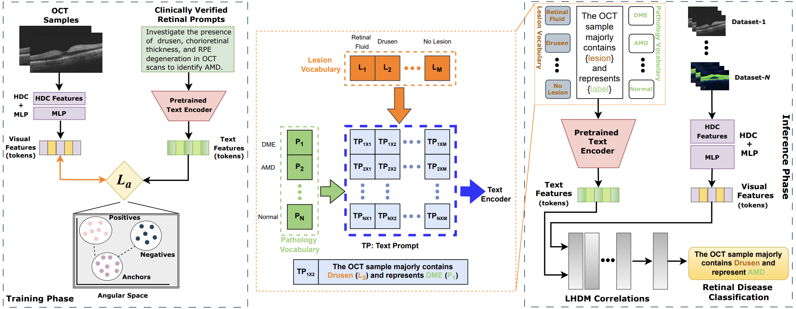

# Language Assisted Learnable Hyperdimensional Computing Framework for Retinal Disease Classification

## Introduction
This repository contains the implementation of the language assisted learnable hyperdimensional computing framework for retinal disease classification. 



## Installation
To run the code, please download and install Anaconda. Afterward, please import the ‘environment.yml’ or alternatively install following packages: 
1. Python 3.7.4 
2. TensorFlow 2.2.0 (CUDA compatible GPU needed for GPU training) 
3. Keras 2.3.1 or above 
4. OpenCV 4.2 
5. Imgaug 0.2.9 or above 
6. Tqdm 

Both Linux and Windows OS are supported.

## Dataset Structure

```
├── trainingDataset
│   ├── train_images
│   │   └── tr_image_1.png
│   │   └── tr_image_2.png
│   │   ...
│   │   └── tr_image_n.png
│   ├── train_annotations
│   │   └── tr_image_1.png
│   │   └── tr_image_2.png
│   │   ...
│   │   └── tr_image_n.png
│   ├── train_prompts
│   │   └── tr_prompt_1.png
│   │   └── tr_prompt_2.png
│   │   ...
│   │   └── tr_prompt_n.png
├── testingDataset
│   ├── test_images
│   │   └── te_image_1.png
│   │   └── te_image_2.png
│   │   ...
│   │   └── te_image_k.png
│   ├── test_annotations
│   │   └── te_image_1.png
│   │   └── te_image_2.png
│   │   ...
│   │   └── te_image_k.png
│   ├── segmentation_results
│   │   └── te_image_1.png
│   │   └── te_image_2.png
│   │   ...
│   │   └── te_image_k.png
```

## Citation
If you use any part of this code in your research, please cite the following paper:

```
@inproceedings{hdc_mlp,
  title   = {Language Assisted Learnable Hyperdimensional Computing Framework for Retinal Disease Classification},
  author  = {Adnan Yaqoob Salik and Shehzad Khalid and Ramsha Ahmed and Fathi Awad and Umer Hameed Shah and Taimur Hassan},
  note = {Under Review in Scientific Reports},
  year = {2025}
}
```
